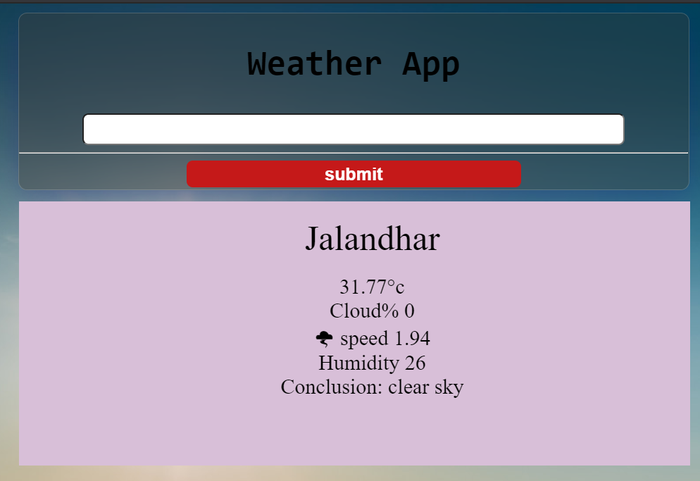

# WEATHER-APP

A simple website made by HTML/CSS/JS. This uses weatehr API to get weather data of the city user eneters

# SCREENSHOTS

# Steps to contribute
1) download this repo
           or
   use Git
   <code>git clone https://github.com/himanshu007-creator/weather-app.git</code>
2) Enjoy!

# Additional features to work upon
- adding favicon
- beautifying UI
- Using screen transactions
